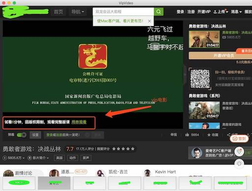
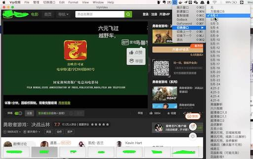

# VIP视频破解

---

## 更新日志

| 更新日期 | 更新内容 |
| ---- | --- |
| 2019-12-23  |  1. 新增VIP解析源  </br> 2. 完成调用本地播放器进行播放视频(利用<font color='red'>MPV</font>软件和<font color='red'>FFPlay</font>软件)  </br>3. 增加一列"更新日志”  </br>4. dmg文件更新 |
| 2019-8-24 |  1. 试部分源，失效源优先级挪低。</div> 2. 更新icon </div> 3. "转换接口"改为"破解接口" </div> 4. 新增音乐破解地址</div>
| 2019-2-21 | 新增2个电视直播源 |
| 2019-2-15 | 全屏时隐藏底部按钮 |
| 2019-1-7 | 修正dmg地址 |
| 2018-7-26 | 更新解析接口 |

----
本软件不做破解，只是破解地址的搬运工
1. 支持各大网站vip视频免费观看。
2. 集合自用视频或者电影URL
3. 集合自用音乐破解URL
4. 集合CCTV等电视播放URL。

* 本软件仅供学习参考，切勿商业使用。接口数据均来源于互联网。如有侵权，请联系删除。

---

## 下载安装地址：
[https://iodefog.github.io/dmg/VipVideo.dmg](https://iodefog.github.io/dmg/VipVideo.dmg)


---


## VIP视频破解 For iPhone

[https://github.com/iodefog/VipVideo-iPhone.git](https://github.com/iodefog/VipVideo-iPhone.git)

---

## 软件功能介绍：
* 破解接口
* 展示窗口
* 新建窗口
* GoBack
* GoFoward
* 切换下一个接口（支持快捷键）
* 切换上一个接口（支持快捷键）
* Safari中打开
* 复制链接（用于分享或者浏览器播放）
* 启用本地播放（TODO:）
* 退出

---

### 主页


### 功能位


---

### 使用方法：

以vip电影《勇敢者游戏决战丛林》为例

* 1.搜索找到vip电影《勇敢者游戏决战丛林》


* 2.进入播放页面, 可以看到需要vip或者劵
 

* 3.利用“破解接口”转换成vip播放地址
 

* 4.可以看到切换后播放器时间已经变味119分钟。尽情享受吧
 

---

### 其他：

1. 如果双击dmg出现提示"文件已损坏，打不开"等提示。原因：mac不支持未在AppStore上架的软件。（提示：本软件未获取任何隐私信息，源码可查，可放心使用）

	解决方法：请在终端输入以下代码，并输入电脑密码，再次打开dmg文件即可。

	```
	sudo spctl --master-disable
	```

2. 如果提示需要安装FlashPlayer才能播放。请先安装FlashPlayer及允许。此外可能需要设置如下配置：


## 依赖软件安装指南：
### MPV 安装介绍

简单安装命令：
```
// 首先安装brew
gem install brew

// 安装mpv
brew install mpv
```
详细安装指南，请参考[https://iodefog.github.io/2019/01/28/mpv/](https://iodefog.github.io/2019/01/28/mpv/)


### FFPlay 安装介绍
```
// 首先安装brew
gem install brew

// 安装ffmpeg和ffplay
brew install ffmpeg --with-sdl2

```
注意 ``` brew install ffmpeg --with-ffplay ``` 已被启用。


----------------------

如有其他问题，请发送邮件 [iodefog@gmail.com](mailto:iodefog@gmail.com)

QQ群：567503018
QQ: 592658688
